# 🧠 Guide за Git и GitHub (с GitHub Desktop)

> 💡 В този guide ще ви запознаем стъпка по стъпка с **Git**, **GitHub**, тяхната екосистема и начина, по който да ги използвате ефективно чрез **GitHub Desktop**. Ще ви покажем как да създавате branch-ове, commit-и, pull request-и.

# 🛠️ Инструментите, с които ще работим 

## 🧩 Какво е Git?

**Git** е **Version Control System – VCS**.  
Тя ви позволява да проследявате промените във вашия код в реално време, да работите в екип с други програмисти, да експериментирате с кода си без риск да загубите работеща версия на проекта си, да следите промените в проекта си назад във времето и много други неща.

### 📖 Представете си:
- Работите по проект - всеки път, когато направите промяна, Git може да направи „снимка“ на текущия ви код и да запази всяка "снимка" в "албум", в който може да разглеждате, премахвате, подменяте и променяте "снимки". 
- Тази "снимка" се нарича **commit**, а "албумът" се нарича **branch**.  
- Може да съществува повече от един branch за проекта ви и съвкупността от всички branch-ове се нарича **repository** (спрямо аналогията по-рано, repository-то е като шкаф, в който складирате всички албуми) 

## ☁️ Какво е GitHub?

**GitHub** е безплатна онлайн платформа, която използва Git, за да съхранява вашите **repository**-та в облак (cloud).  

### 📦 GitHub ви позволява да:
- съхранявате своите Git проекти онлайн.
- споделяте код с други.
- използвате **Pull Requests** за контрол на промените.
- работите с **Issues**, **Projects**, **Actions** и други инструменти за по-добра организация, които ще засегнем по-късно.

## 💻 Какво е GitHub Desktop?

**GitHub Desktop** е официално настолно приложение (desktop app), създадено от GitHub, което ви позволява да работите с Git и GitHub **без нужда от сложни команди и работа с terminal-а**.  

То предоставя **графичен интерфейс (GUI)**, чрез който можете лесно и интуитивно да:
- **създавате, клонирате и управлявате repository-та** само с няколко клика;  
- **създавате branch-ове** и превключвате между тях визуално;  
- **правите commit-и**, без да пишете команди;  
- **синхронизирате промените** с GitHub (push и pull операции);  
- **създавате и преглеждате pull request-и** директно от приложението;  
- **разрешавате конфликти** между branch-ове чрез удобен интерфейс;  
- **виждате историята на промените** във всеки файл.  

> 💡 GitHub Desktop е особено полезен за начинаещи, тъй като визуализира основните концепции на Git (като commits, branches и merges) и ви помага да ги разберете без сложни команди.  

### 🔗 Връзката между Git, GitHub и GitHub Desktop

| Инструмент | Роля |
|-------------|------|
| **Git** | Основната система за контрол на кода ви (работи локално, на вашия компютър). |
| **GitHub** | Онлайн платформа, която използва Git, за да съхранява вашите **repository**-та в облак. |
| **GitHub Desktop** | Графичен интерфейс, който ви помага да използвате Git и GitHub по-лесно, без да пишете сложни команди. |

> 🧠 Накратко: Представете си, че работите с **фотоалбум**.

> 📷 **Git** е **фотоапаратът** — той записва всяка промяна, която правите по снимките си (commit).  
  Можете да се връщате назад, да сравнявате версии и да запазвате моментите от развитието на проекта си.  

> ☁️ **GitHub** е **облачният албум** (като Google Photos или iCloud), където качвате своите снимки,  
  за да ги пазите на сигурно място и да ги споделяте с други хора.  

> 🖥️ **GitHub Desktop** е **галерията на вашия компютър** — приложение, в което виждате снимките си,  
  подреждате ги, добавяте нови, правите промени и синхронизирате с онлайн албума,  
  без да се налага да пишете команди или да използвате терминал.  

> Така: **Git** улавя всеки момент, **GitHub** го пази и споделя,  
> а **GitHub Desktop** ви позволява лесно да разглеждате и подреждате цялата колекция.
---
---

## ⚙️ Инсталиране и/или подготвяне на инструментите (Git, GitHub и GitHub Desktop)

###  Инсталиране на Git
1. Влезте в [https://git-scm.com/downloads](https://git-scm.com/downloads).  
2. Изтеглете и стартирайте инсталатора за вашата операционна система.  
3. По време на инсталацията е **силно препоръчително** да оставите повечето настройки по подразбиране (вижте точките отдолу).
> ⚠️ Важно е да изберете удобен за вас git editor. Editor-а по подразбиране е Vim, който е много мощен, но и много труден за използване. Самият editor няма да ни бъде важен/нужен за целите на курса, но ще ви бъде полезно в бъдеще ако ви се наложи да го използвате!   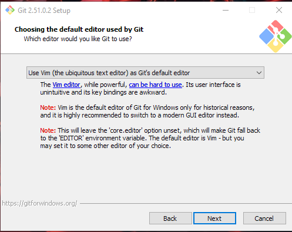  
> ⚠️ Уверете се, че **“Use Git from the command line and also from 3rd-party software”** е избрано!   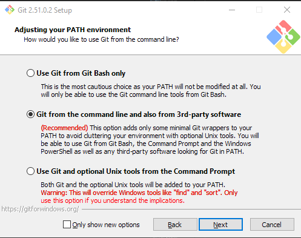

### Създаване на профил в GitHub
1. Влезте в [https://github.com/](https://github.com/)
2. Цъкнете **Sign Up** в горния десен ъгъл и си направете профил.

###  Инсталиране на GitHub Desktop
1. Влезте в [https://desktop.github.com/](https://desktop.github.com/).  
2. Инсталирайте програмата и я стартирайте.  
3. Ще видите прозорец за вход – тук ще се свържете със своя GitHub акаунт, който създадохме по-рано.
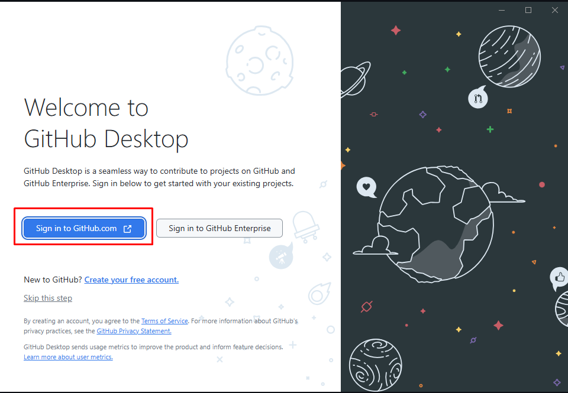

---

## 🧠 Използване на Git за качване на вашите домашни
> За да не омажем официалното repository на курса с безмислени pull request-и (https://github.com/KristianIvanov24/Introduction-to-Programming-SE), може да използвате (https://github.com/Gergi3/test-repo-for-students) за тестови цели докато схванете стъпките по-долу. Пробвайте да следвате стъпките и да качите някакъв .cpp файл в тестовото репо.

За по-лесно разбиране може да следите следната картинка, която описва стъпките по-долу:
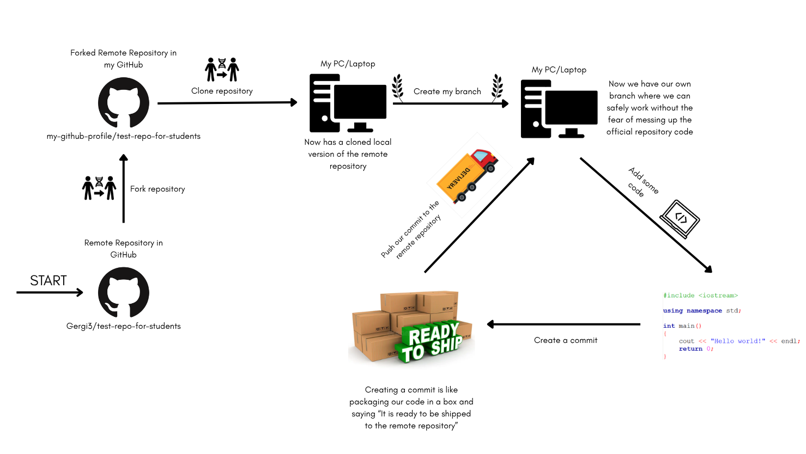

1. Като за начало, ако нямаме права за писане директно в repository-то (което във вашия случай е така), трябва да го **fork**-нем (fork-а е копие на repository в нашия си профил, при нашите repository-та).
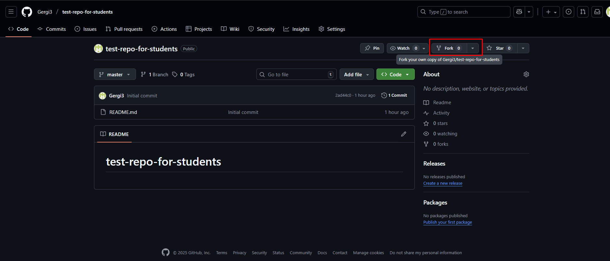
---
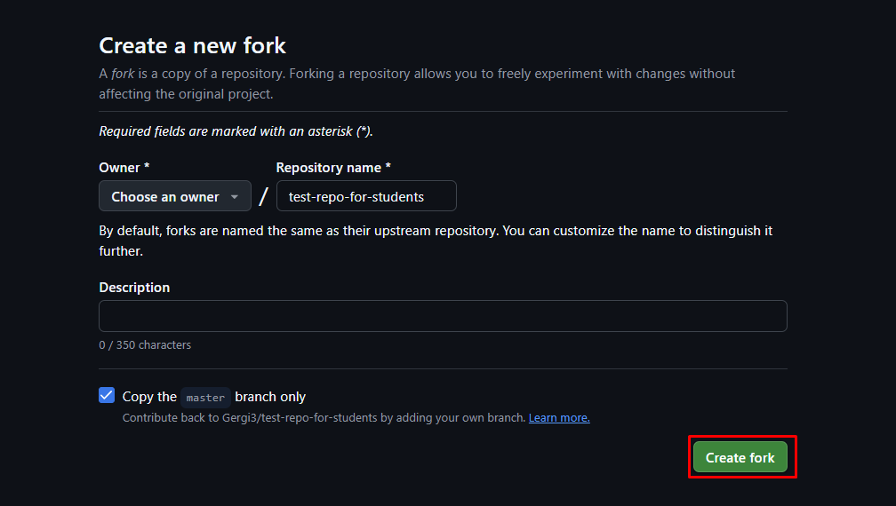
Ако отидем в нашия профил, там е fork-а на repository-то.
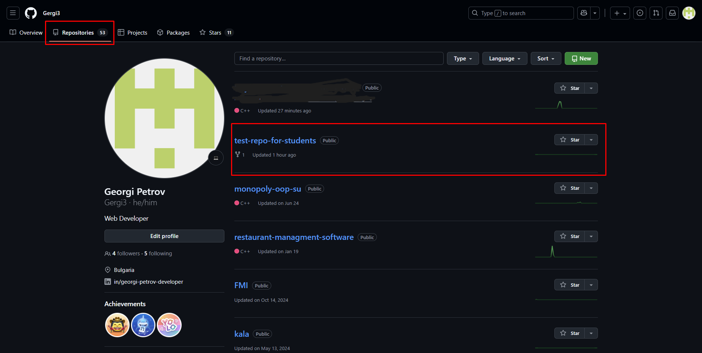

2. Сега трябва да clone-нем нашето forked repository на компютъра си. За целта ще използваме GitHub Desktop. Избираме "Clone a repository from the internet". Намираме нашия fork, и на "Local path" задаваме къде на компютъра ни да се клонира. Накрая избираме "Clone".
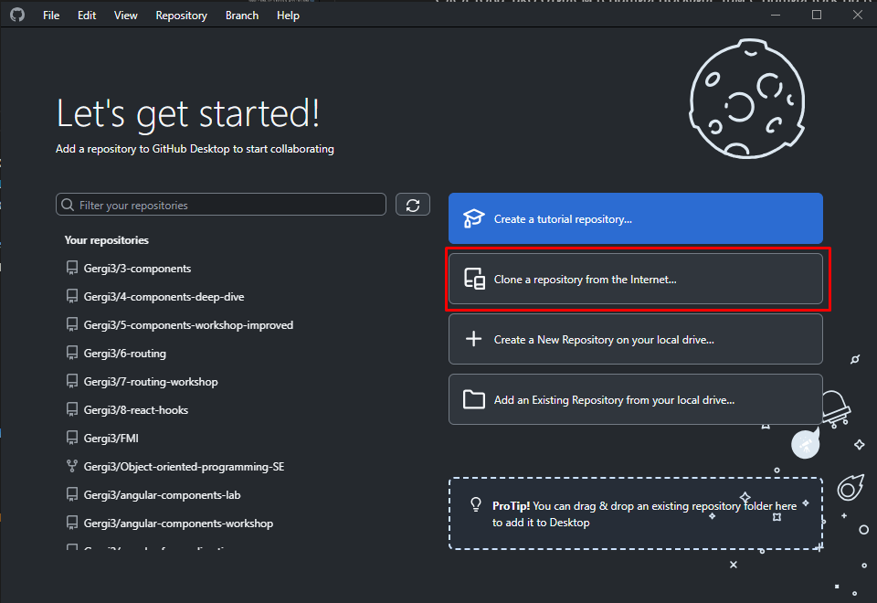
---
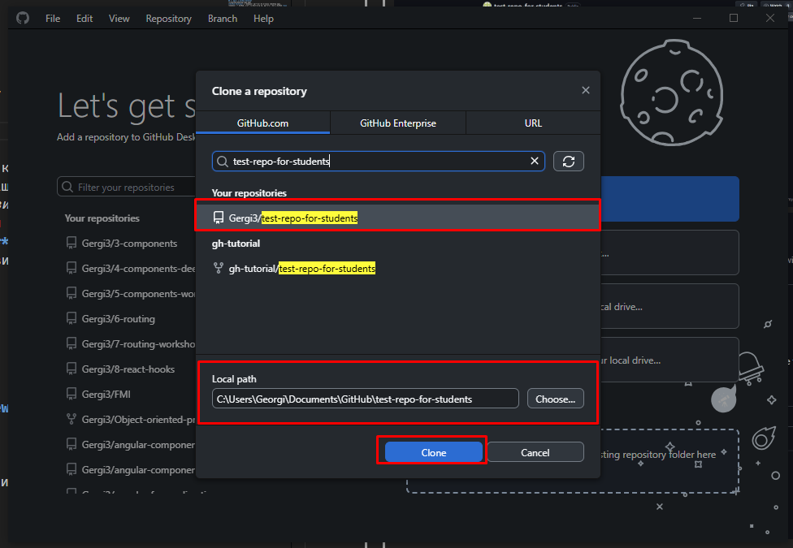
---
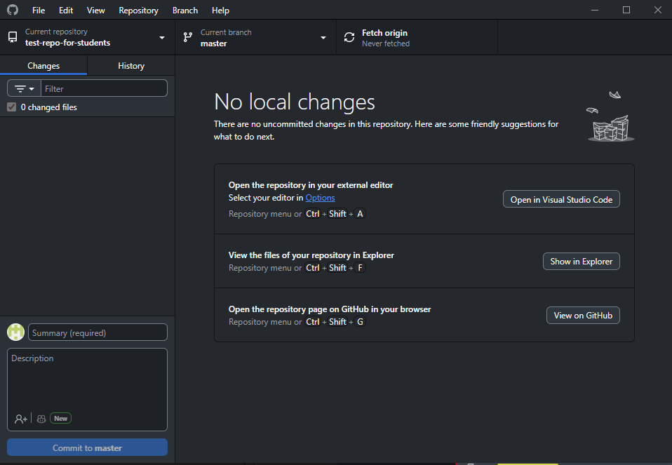

3. Трябва да създадем наш branch, върху който да работим. Името не е от значение, но нека е вашето име и фамилия написано на kebab-case, за да може лесно да разпознаваме кой е вашия branch. (примерно georgi-petrov, aleksandar-mandev, kristian-ivanov)
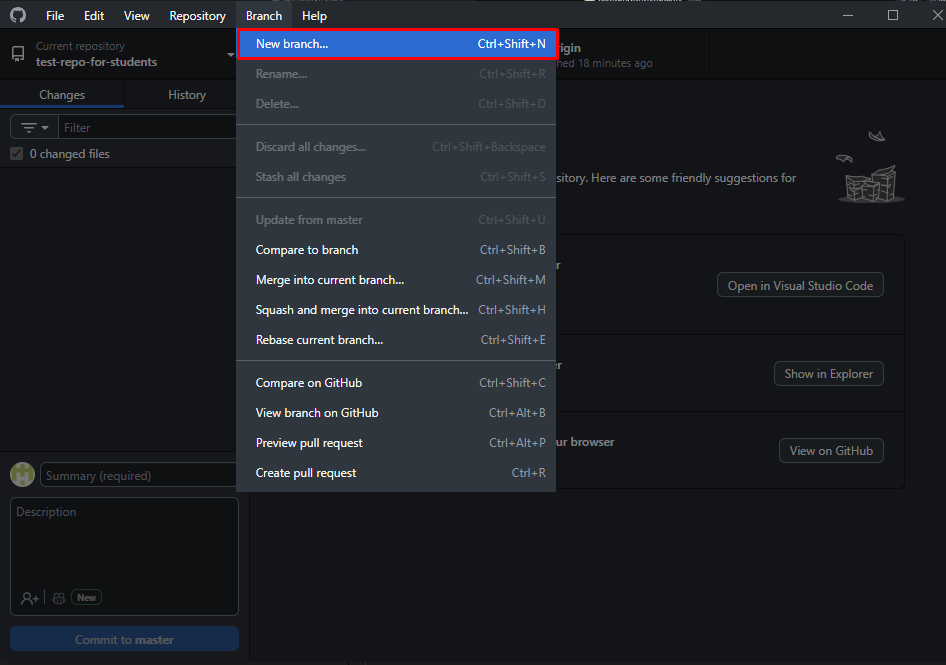

> ⚠️ Стъпките 1, 2 и 3 са **ЕДНОКРАТНИ**. **НЕ** трябва всеки път да fork-вате, клонирате repository-то и после да си правите branch. Веднъж щом бъде клонирано на компютъра ви, може да работите върху него многократно!

4. Когато отидем в папката, където сме клонирали нашето repository, можем да видим всички файлове в него, да ги редактираме, да ги изтриваме и да добавяме нови. Всяка една промяна ще се отразява в GitHub Desktop.
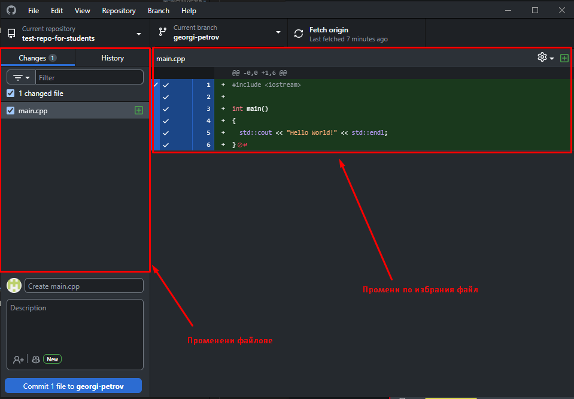

5. Когато сме готови с всички промени е време да създадем commit, който да изпратим към remote repository-то (към GitHub). Пишем име на commit-а и избираме "Commit X files to branch-name"

6. За да изпратим commit-а към remote repository-то избираме "Publish branch/Push origin"
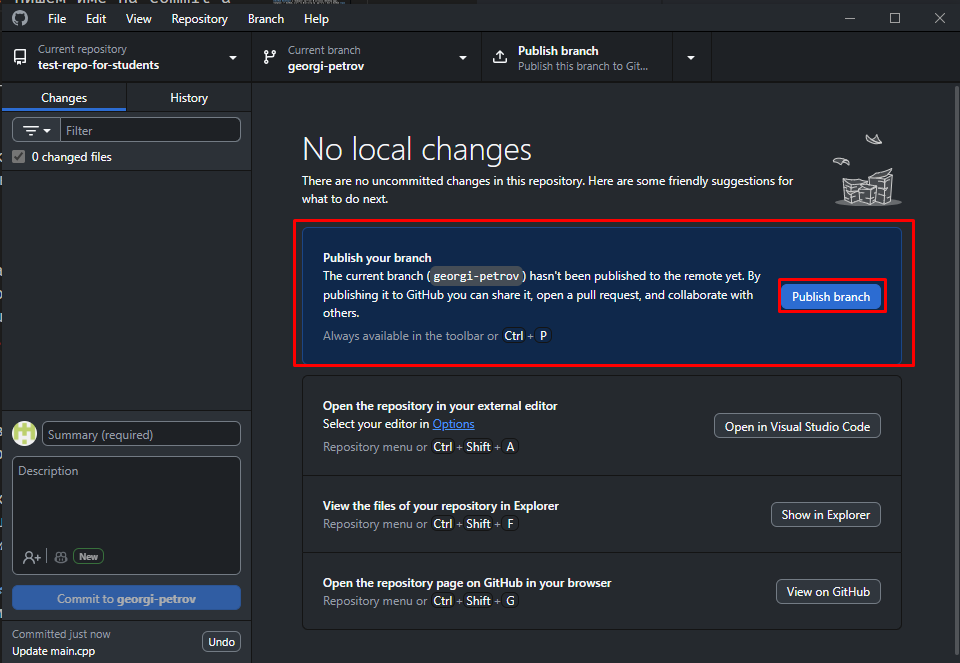

7. Сега ако отидем обратно в нашия GitHub при fork-натото repository, и изберем нашия branch можем да видим отразените промени 🥳🎉. Можем да видим всички commit-и в таба "Commits" и да видим всяка промяна направена със всеки commit.
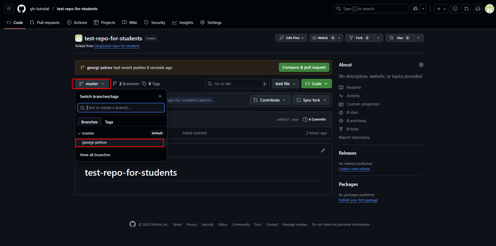
---
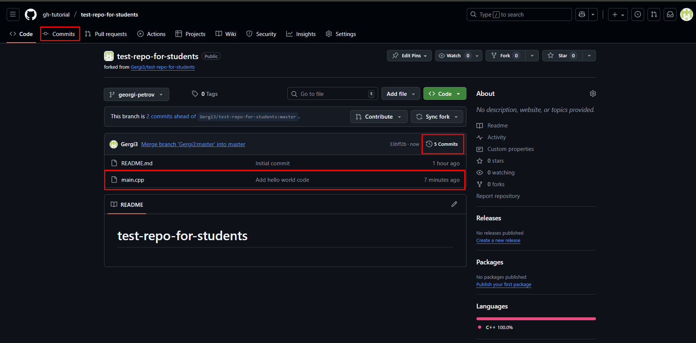

8. Но промените ни все още не са качени за обратна връзка в оригиналното repository. Помнете! Fork-а е копие на цялото repository в НАШИЯ профил, което е различно от оригиналното repository. GitHub дори ни известява, че нашото repository е "X commits ahead". Това значи, че нашето repository има X промени повече от оригиналното.
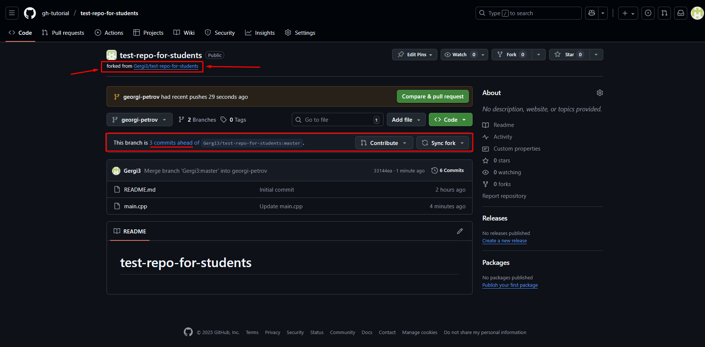

9. За да пуснем нашия код за обратна връзка, трябва да отидем в таба "Pull requests" и да създадем нов Pull Request.
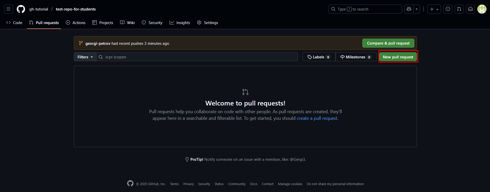
---

10. Пишем заглавие и описание на pull request-а (примерно кое домашно качвате, коя задача ви е затруднила и т.н.) и избираме "Create pull request". В този pull request ще даваме нашата обратна връзка за решенията ви на домашните. 
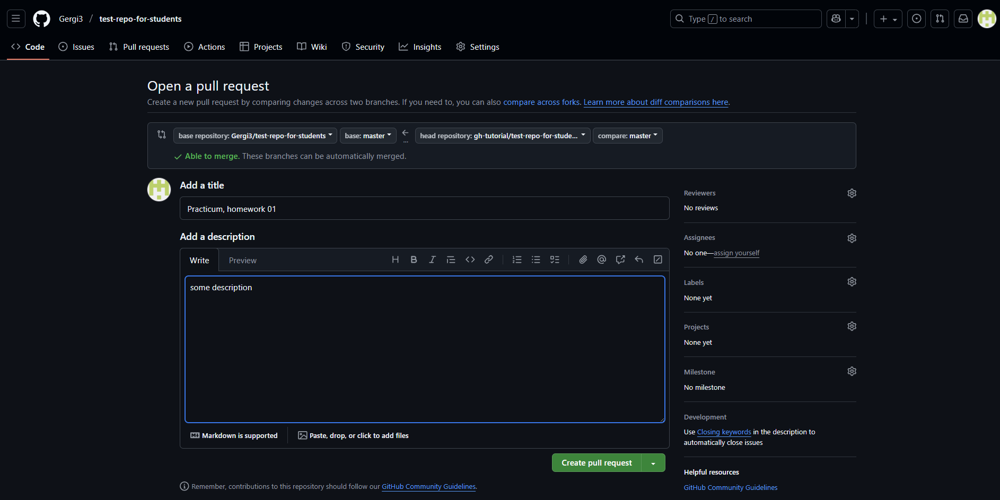
---
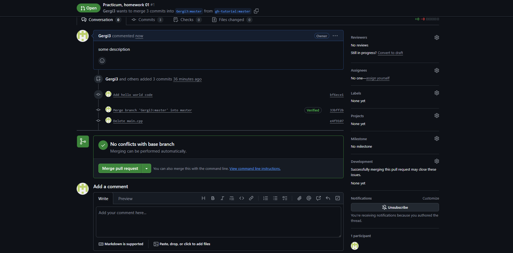

## 📌 Важни забележки
1. Когато се качат нови практикуми/семинари в оригиналното repository, те не се прехвърлят автоматично във вашия fork. Затова е много важно да синхронизирате вашия fork (както master branch-а, така и вашия branch) редовно.  
Синхронизацията прехвърля всички файлове, които са в оригиналното repository и липсват във вашия fork. Също много важно е да не commit-вате промени по README.md файловете и решенията, които ние ви качваме, защото тогава при следваща синхронизация се получават конфликти. (Конфликт значи, че git не знае какво да прави, защото това, което синхронизирате от оригиналното repository, е различно от това, което имате при вас). Ето как се синхронизира:
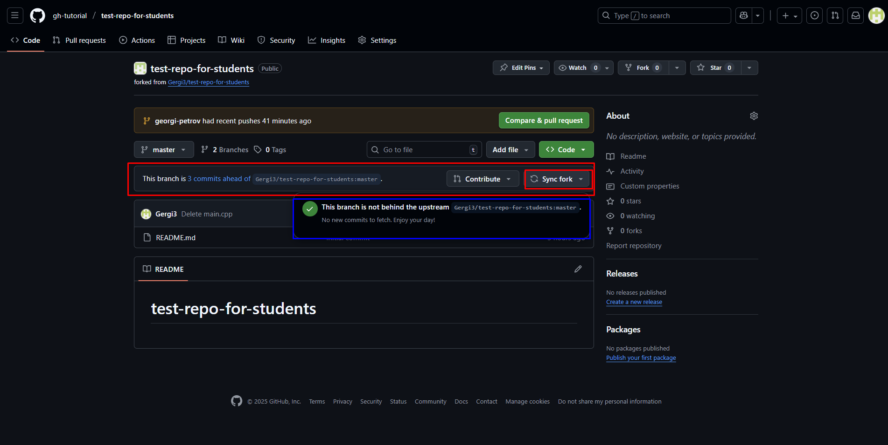
Във синята кутийка ще излезе бутон "Sync/Synchronise"
> ⚠️ За най-безконфликтен вариант, синхронизирайте вашия fork след всеки семинар/практикум.
3. При проблеми с качването на решения се свържете с нас и ще помогнем, не се притеснявайте да питате!
---
## 📚 Полезни ресурси

- 📘 [Официална книга за Git](https://git-scm.com/book/en/v2)  
- 💻 [GitHub Docs](https://docs.github.com/en)  
- 🖥️ [GitHub Desktop документация](https://docs.github.com/en/desktop)  
- 🎥 [Git и GitHub видео курс (Traversy Media)](https://www.youtube.com/watch?v=RGOj5yH7evk)  
- 🧰 [Шаблони за .gitignore](https://github.com/github/gitignore)

---
## Работата с git е тегава в началото
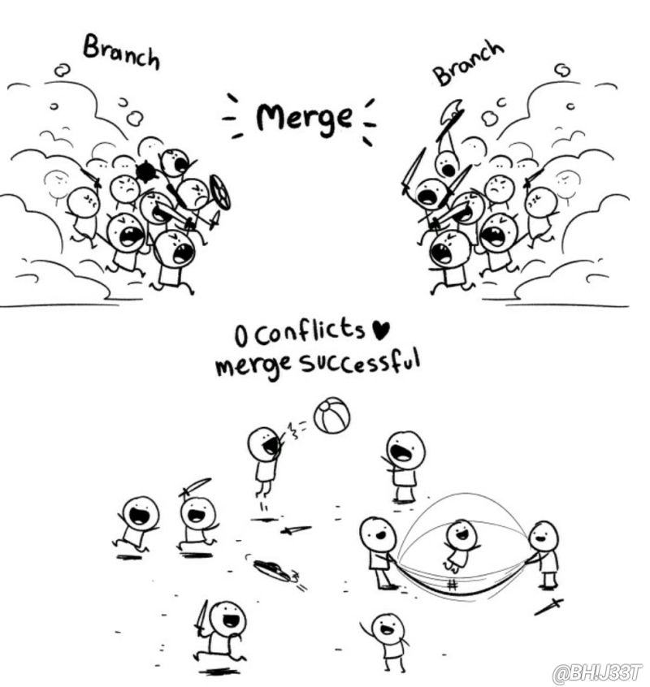
---
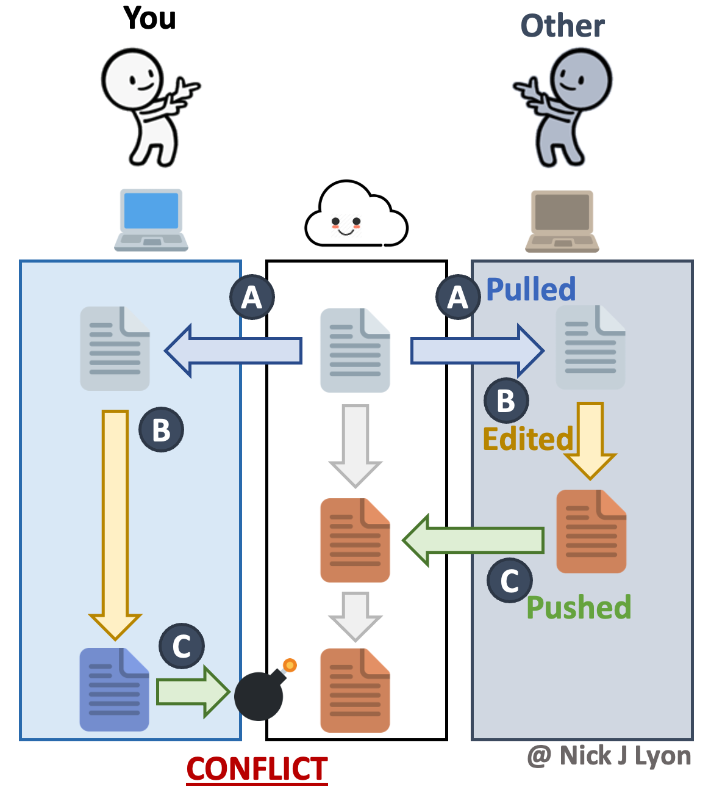