# Инсталация на Visual Studio за C++ на Windows

Това ръководство ще ви помогне да инсталирате **Visual Studio** и да настроите **C++** като основна среда за програмиране.

## Важна информация за инсталация на среда за разработка на C++

> ⚠️ Препоръчително е да използвате Visual Studio за целите на курса, тъй като:  
> - Всички семинари и практикуми ще се водят на Visual Studio.  
> - Използването на Visual Studio ще бъде необходимо за някои изпити и/или контролни.  

Въпреки това имате пълната свобода да използвате и други компилатори или среди за разработка (IDE), макар че **НЕ Е ПРЕПОРЪЧИТЕЛНО**. Примери за алтернативни компилатори и среди:  
- **GCC / MinGW**  
- **Clang / LLVM**  
- **Code::Blocks**  
- **Dev-C++**  
- **CLion**

## За Mac потребителите

На Mac Visual Studio не е налично както при Windows, но има няколко алтернативи:  
- **Visual Studio Code** с C++ разширение (**препоръчително**)  
- **Xcode** – официалната IDE на Apple за C и C++. Включва Clang компилатор и всичко необходимо.  
- **CLion** – платено IDE  

YouTube ръководство за **Visual Studio Code** с C++ на Mac: https://www.youtube.com/watch?v=v2_Pth8MrKA  

---

## За Windows потребителите

### 1. Сваляне на Visual Studio

1. Отидете на официалния сайт на Visual Studio за изтегляне:  
   [https://visualstudio.microsoft.com/downloads/](https://visualstudio.microsoft.com/downloads/)  

2. Кликнете върху бутона **Free Download** под секцията **Community**.  

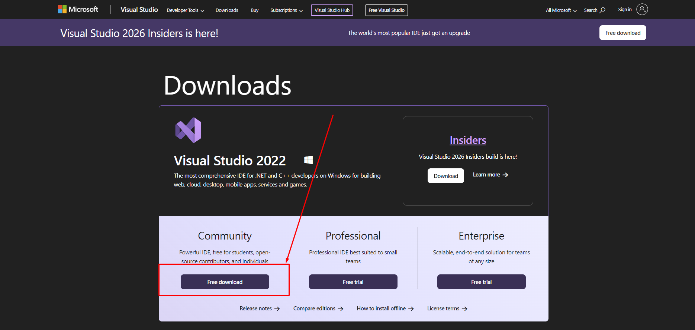

Ще започне изтеглянето на инсталатора (`VisualStudioSetup.exe`).  

---

### 2. Стартиране на инсталацията

1. След като инсталаторът се свали (`VisualStudioSetup.exe`), стартирайте го, изчакайте малко и натиснете `Continue` на появилия се прозорец. 

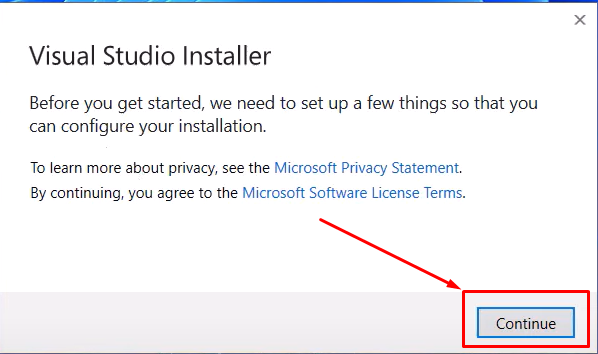

2. В прозореца на инсталацията ще видите списък **Workloads** с компоненти. Скролнете надолу и изберете **Desktop development with C++**.  

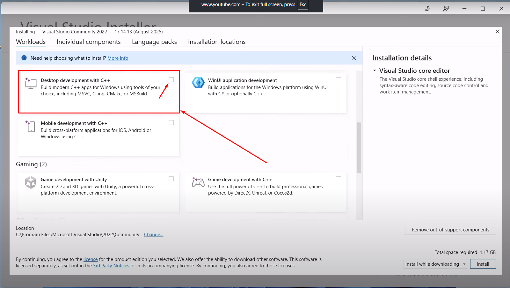  
     Това са необходимите инструменти за работа със C++ (компилатор, библиотеки и др.).  

3. Натиснете **Install** и изчакайте процесът да завърши. Това може да отнеме няколко минути.  

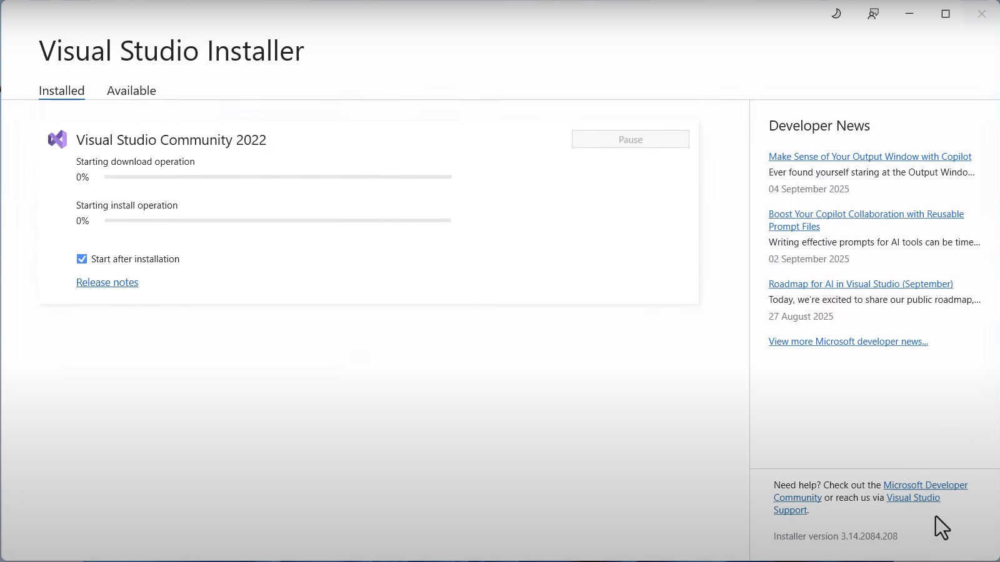

4. След като инсталацията приключи, ще се появи прозорец, който ви уведомява, че инсталацията е завършена. Препоръчително е да рестартирате своя компютър/лаптоп.  

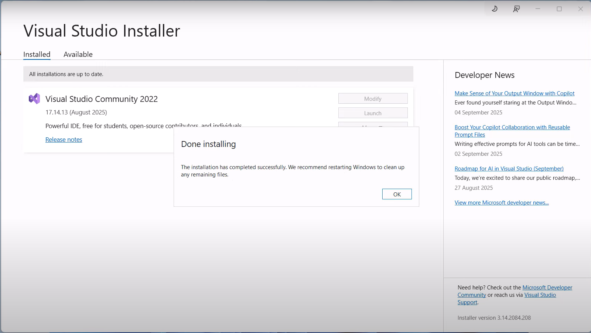  

---

### 3. Първо стартиране на Visual Studio

1. Стартирайте Visual Studio от търсачката на Windows.  

2. При първо стартиране ще ви поиска да влезете в своя профил в GitHub/Microsoft (може да пропуснете тази стъпка чрез бутона "Skip and add accounts later") и да настроите някои предпочитания за Visual Studio (за темата препоръчваме тъмна, за да не ви изморява очите, тъй като ще прекарвате много време във Visual Studio).  

---

### 4. Създаване на първи C++ проект

1. В основния прозорец изберете **Create a new project**.  

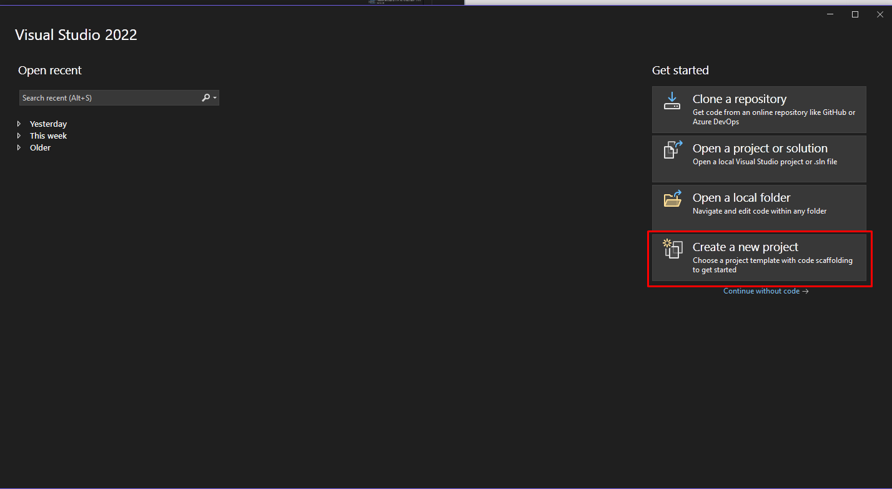

2. В полето за търсене напишете `Console App` и изберете иконката, показана на картинката. След това натиснете бутона `Next` в долния десен ъгъл.  

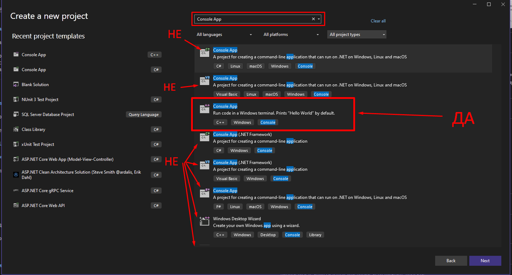

3. Въведете име на проекта (Project name), място за записване в компютъра ви (Location) и име на работно пространство (Solution name). Ако не можете да промените "Solution name", махнете отметката от "Place solution and project in the same directory". Накрая натиснете **Create**.  

> 💡 Един Solution е място, където можете да създавате много програми на C++ събрани на едно място. Интуитивно може да си го представите като (виртуална) папка, в която да държите няколко проекта. Например, всички програми, които пишем на първия практикум следва да са в един solution (примерно up-practicum-01), а задачите на втория практикум - в друг (примерно up-practicum-02).  

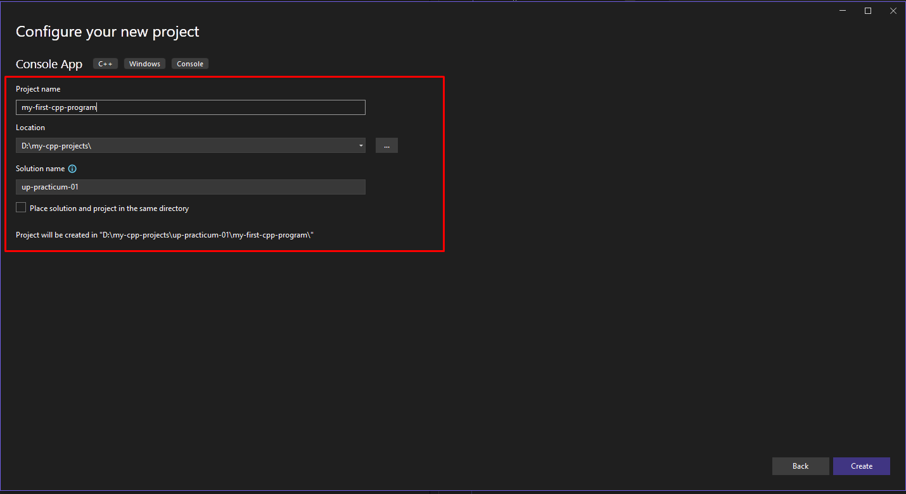

4. Visual Studio ще създаде програма на C++ с основния файл `program-name.cpp`.  

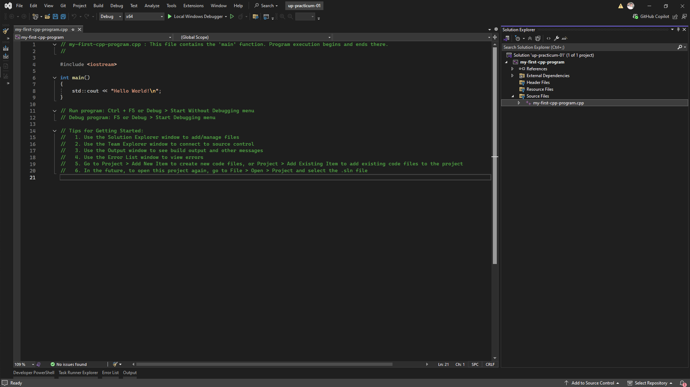  

---

### 5. Компилиране и стартиране на първи C++ проект

1. В прозореца с кода натиснете **Ctrl + F5** или **зеленият триъгълник горе**.  

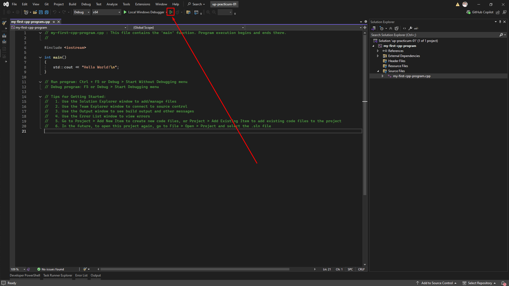

2. Ще се отвори конзолен прозорец, който ще изпълни вашата програма 🎉.

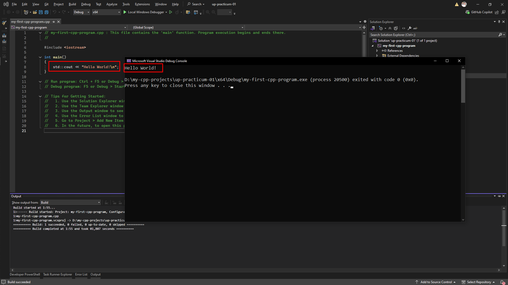  
